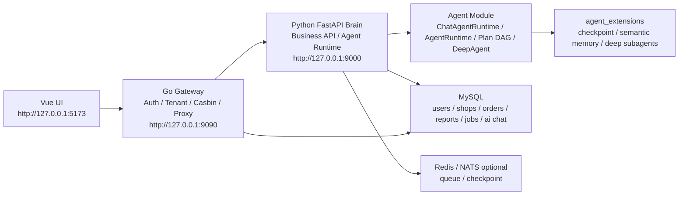
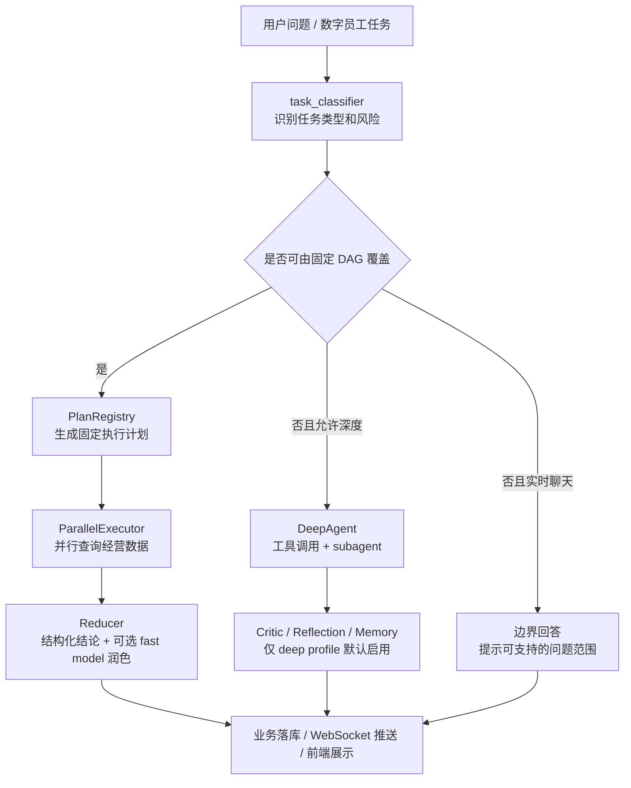

# EcommerceAgent

EcommerceAgent 是一个面向电商运营场景的数字员工平台。项目目标不是做一个简单的聊天 Demo，而是把账号体系、店铺数据导入、经营分析、Agent 工作流、报告生成、策略审核和前端可视化串成一套可落地的 SaaS 原型。

当前重点能力：

- 用户注册、登录、租户、店铺和权限由 Go Gateway 统一处理，并持久化到 MySQL。
- Python FastAPI Brain 负责电商业务数据、AI 对话、数字员工任务、报告、商品、库存、活动和策略审核。
- Agent 模块采用轻重分层：AI Chat 走轻量实时链路，深度任务才进入 DeepAgent。
- 常见电商问题优先走 Plan-first 并行 DAG，不再让主 Agent 串行“一步一步想”。
- 前端 Vue 应用提供工作台、AI 对话、数据导入、数字员工、报告中心、商品分析、库存风险、活动复盘和个人中心。

## 架构总览



### 分层职责

| 层级 | 目录 | 职责 |
| --- | --- | --- |
| 前端应用 | `ui/` | Vue 3 + Vite，承载用户操作、AI 对话、工作台、报告展示和 Agent 进度可视化。 |
| 网关层 | `gateway/` | 登录注册、JWT、租户和店铺上下文、Casbin 权限、Brain API 代理、WebSocket 代理。 |
| Python Brain | `api/` | 业务 API、数据导入、工作台聚合、Agent 任务队列、AI Chat 持久化、报告和策略落库。 |
| Agent 核心 | `agent/` | 任务分类、模型路由、轻量聊天运行时、深度运行时、并行 DAG、Reducer、Critic、记忆、观测。 |
| Agent 扩展 | `agent_extensions/` | 深度任务才启用的可选能力：checkpoint、语义记忆、知识库和网络搜索 subagent。 |
| 工具层 | `tools/` | 数据库工作流、文件读取、Markdown/PDF、RAGFlow、Tavily 等 LangChain 工具。 |
| 数据脚本 | `data/`、`scripts/` | MySQL schema、租户迁移、示例数据、smoke 测试、开发环境重置。 |

## Agent 模块设计

Agent 是本项目的核心。当前实现遵循一个原则：用户可见的实时体验优先快，只有明确的深度任务才使用重 Agent 链路。

### 运行时分层

| 运行时 | 入口 | 使用场景 | 特点 |
| --- | --- | --- | --- |
| ChatAgentRuntime | `agent/chat_agent_runtime.py` | AI 对话、实时问答 | 不导入 `main_agent.py`，不构建 DeepAgent，不写长期记忆，不跑 Critic。 |
| AgentRuntime | `agent/runtime/agent_runtime.py` | 数字员工、报告、深度分析任务 | 阶段化执行：上下文准备、工作流、DeepAgent fallback、Critic、持久化、记忆写入、trace 收尾。 |
| DeepAgent | `agent/main_agent.py` | 未被规则 DAG 覆盖的复杂深度任务 | 只在 deep profile 或受控 fallback 中构建。 |

### Agent 执行链路



### Plan-first 并行 DAG

传统多 Agent 慢的主要原因是串行决策：主 Agent 决定下一步，等待工具，再决定下一步。项目现在把高频电商任务改成固定计划：

1. `agent/planning/task_classifier.py` 识别任务类型，例如爆品分析、商品优化、库存风险、活动复盘、经营日报、季节选品。
2. `agent/runtime/plan_registry.py` 生成固定 DAG，任务步骤一次性确定。
3. `agent/runtime/parallel_executor.py` 并行执行独立数据步骤，每个 step 有独立 timeout，整体也有 global timeout。
4. `agent/runtime/reducer.py` 先生成确定性结构化结论，再用 fast model 做可选润色。
5. 如果关键步骤失败，按 profile 决定是降级返回还是进入 DeepAgent fallback。

这种设计让常见问题不再依赖 LLM 多轮推理才能产出结果，适合商业化产品里的稳定 SLA。

### Agent 目录说明

| 文件或目录 | 功能 |
| --- | --- |
| `agent/llm.py` | 模型获取入口，只保留 fast、standard、deep、critic 四类明确函数。 |
| `agent/core/llm_router.py` | 模型路由。轻量任务使用 `LLM_FAST_MODEL`，深度任务使用 `LLM_DEEP_MODEL`。 |
| `agent/chat_agent_runtime.py` | AI Chat 专用轻量运行时，负责 prompt guard、分类、workflow 调度和实时结果返回。 |
| `agent/main_agent.py` | DeepAgent 构建入口，只在标准或深度任务真正需要时懒加载模型、工具、subagent、checkpoint。 |
| `agent/runtime/profiles.py` | realtime、standard、deep 三档运行预算，包括模型调用数、工具调用数、subagent 数和 wall time。 |
| `agent/runtime/budget.py` | Agent 执行预算对象和超预算异常。 |
| `agent/runtime/agent_runtime.py` | 深度任务编排器，串联上下文、workflow、DeepAgent、Critic、持久化、记忆、trace。 |
| `agent/runtime/agent_runner.py` | DeepAgent 流式执行、工具调用计数、循环检测和反思重试。 |
| `agent/runtime/plan_registry.py` | 固定 DAG 计划注册表。 |
| `agent/runtime/parallel_executor.py` | DAG 并行执行器，调用真实业务查询并返回结构化 step result。 |
| `agent/runtime/reducer.py` | 将 step result 汇总成结论、证据、动作、风险和缺失数据。 |
| `agent/runtime/result_pipeline.py` | 结果后处理：Critic、reflection、policy proposal、memory write、trace。 |
| `agent/workflows/business_metrics.py` | 电商经营数据查询口径。 |
| `agent/workflows/workflow_runner.py` | workflow 统一入口，优先 Plan-first，必要时 fallback。 |
| `agent/memory/` | MySQL 长期记忆、候选记忆提取、记忆审核和可选语义检索入口。 |
| `agent/critic/` | Critic 策略和模型校验，仅 deep profile 默认启用。 |
| `agent/evolution/` | 任务反思和策略演进候选生成。 |
| `agent/observability/` | trace 写入、timeline、metrics、慢任务分析数据源。 |
| `agent/diagnostics/` | 单任务诊断和慢阶段分析。 |
| `agent/security/` | prompt guard、权限校验、敏感信息脱敏。 |
| `agent/sub_agents/database_query_agent.py` | 数据库经营分析 subagent。 |

### Agent 扩展目录

`agent_extensions/` 中的能力默认不进入实时热路径，只在 deep profile 或显式开关启用：

| 目录 | 功能 |
| --- | --- |
| `agent_extensions/checkpointing/` | DeepAgent checkpoint。 |
| `agent_extensions/semantic_memory/` | BGE / Milvus 语义记忆索引和检索。 |
| `agent_extensions/deep_subagents/` | 知识库 subagent 和网络搜索 subagent。 |

## 模型配置

项目已经收敛为两档模型：

```env
OPENAI_BASE_URL=https://api.openai.com/v1
OPENAI_API_KEY=your-api-key
LLM_PROVIDER=openai
LLM_TEMPERATURE=0.2

LLM_FAST_MODEL=gpt-5.4-mini
LLM_DEEP_MODEL=gpt-5.5
LLM_FAST_TIMEOUT_SECONDS=8
LLM_FAST_MAX_RETRIES=1
LLM_DEEP_TIMEOUT_SECONDS=60
LLM_DEEP_MAX_RETRIES=1
```

实际路由：

| Profile | 模型 | 用途 |
| --- | --- | --- |
| `fast_model` | `gpt-5.4-mini` | AI Chat、分类、轻量总结。 |
| `standard_model` | `gpt-5.4-mini` | 标准数字员工、数据库 workflow、普通报告。 |
| `critic_model` | `gpt-5.4-mini` | Critic 和监督检查。 |
| `deep_model` | `gpt-5.5` | deep profile 的完整 DeepAgent。 |

## Python Brain

Python Brain 是业务和 Agent 的主要承载层。

| 目录 | 功能 |
| --- | --- |
| `api/server.py` | FastAPI 入口、WebSocket、任务队列启动、Agent 任务分发。 |
| `api/routes/` | 业务 API 路由：workspace、dashboard、products、inventory、campaigns、reports、agents、ai_chat、data_import 等。 |
| `api/services/` | 业务服务：工作台聚合、导入、报告、Agent job、AI Chat 持久化、经营查询。 |
| `api/task_queue.py` | inline / Redis / NATS 任务队列抽象和 profile 并发控制。 |
| `api/task_runtime.py` | 后台任务状态、取消、结果同步。 |
| `api/monitor.py` | WebSocket 事件推送、assistant delta/final/error、Agent timeline。 |
| `api/db.py` | 平台业务表 schema 初始化。 |

AI Chat 当前采用异步受理：

1. 前端调用 `POST /api/v1/ai-chat/messages`。
2. Gateway 注入 tenant/user/shop 后代理到 Brain。
3. Brain 创建 conversation、message、run，并立即返回 running。
4. 后台任务进入 `ChatAgentRuntime`。
5. WebSocket 推送进度、草稿和最终答案。
6. 任务完成后写回 `ai_chat_messages` 和 `ai_chat_runs`。

数字员工和报告任务：

1. 前端调用 reports / products / inventory / campaigns / agents 的生成接口。
2. Brain 创建 `agent_jobs` 和关联报告草稿。
3. 后台进入 `AgentRuntime`。
4. workflow 完成后回写 `business_reports`、`strategy_reviews`、`agent_jobs`。

## Go Gateway

Gateway 是商业化 SaaS 边界层，负责安全和租户上下文。

| 目录 | 功能 |
| --- | --- |
| `gateway/cmd/server/` | Go 服务启动入口。 |
| `gateway/internal/auth/` | MySQL 用户存储、JWT、用户与租户店铺关系。 |
| `gateway/internal/authorization/` | Casbin 权限模型和策略。 |
| `gateway/internal/middleware/` | Auth、Tenant、Request ID、CORS 中间件。 |
| `gateway/internal/proxy/` | Python Brain 反向代理。 |
| `gateway/internal/router/` | `/api/v1` 路由挂载。 |
| `gateway/configs/casbin/` | Casbin model 和默认 policy。 |

Gateway 默认使用 MySQL 用户存储，不再使用 JSON 文件作为商业化运行模式。

## 前端 UI

前端位于 `ui/`，使用 Vue 3、TypeScript、Vite。

主要页面：

- 登录 / 注册 / onboarding。
- 工作台：经营指标、库存风险、策略审核、报告摘要。
- AI 对话：左侧对话，右侧 Agent 状态和进度。
- 数据导入：示例导入、CSV/Excel、粘贴 CSV/TSV。
- 商品分析、库存风险、活动复盘。
- 经营报告：报告列表、报告详情、Markdown 风格展示。
- 数字员工：任务启动、报告生成、进度轮询。
- 个人中心：企业、店铺、权限、安全信息。

前端 API 封装在 `ui/src/services/platformApi.ts`。

## 数据模型

核心数据由 MySQL 承载：

- Gateway 用户域：`gateway_users`、`gateway_tenants`、`gateway_shops`、`gateway_user_tenants`、`gateway_user_shops`。
- 电商经营域：订单、商品、库存、流量、活动、退款、平台集成等。
- Agent 任务域：`agent_jobs`、`business_reports`、`strategy_reviews`。
- AI Chat 域：`ai_chat_conversations`、`ai_chat_messages`、`ai_chat_runs`。
- 记忆域：`agent_memories`、`agent_memory_reviews`。

Schema 和初始化脚本位于：

- `data/ecommerce_demo/schema.sql`
- `data/ecommerce_demo/platform_schema.sql`
- `data/ecommerce_demo/tenant_shop_migration.sql`
- `data/ecommerce_demo/seed_ecommerce_demo.py`

## 环境要求

- Windows PowerShell 5.1 或 PowerShell 7。
- Python 3.11+。
- Go 1.22+。
- Node.js 20+。
- MySQL 8+。
- 可选：Redis、NATS、Milvus。

## 快速启动

1. 复制环境变量：

```powershell
Copy-Item .env.example .env
```

2. 修改 `.env` 中的必要配置：

```env
OPENAI_BASE_URL=https://api.openai.com/v1
OPENAI_API_KEY=your-api-key
MYSQL_HOST=localhost
MYSQL_PORT=3306
MYSQL_USER=root
MYSQL_PASSWORD=your-password
MYSQL_DATABASE=ecommerce_demo
GATEWAY_JWT_SECRET=dev-only-change-me
```

3. 首次安装依赖并启动：

```powershell
.\start-dev.cmd -Install
```

4. 日常启动：

```powershell
.\scripts\start-dev.ps1
```

默认端口：

| 服务 | 地址 |
| --- | --- |
| Vue UI | `http://127.0.0.1:5173` |
| Go Gateway | `http://127.0.0.1:9090` |
| Python Brain | `http://127.0.0.1:9000` |
| Gateway Health | `http://127.0.0.1:9090/health` |

## 手动启动

Python Brain：

```powershell
.\.venv\Scripts\python.exe -m uvicorn api.server:app --host 127.0.0.1 --port 9000
```

Go Gateway：

```powershell
$env:PYTHON_BRAIN_URL="http://127.0.0.1:9000"
$env:GATEWAY_ADDR=":9090"
go run ./gateway/cmd/server
```

Vue UI：

```powershell
Push-Location ui
npm install
npm run dev
Pop-Location
```

## 常用脚本

| 脚本 | 功能 |
| --- | --- |
| `scripts/start-dev.ps1` | 启动 Brain、Gateway、UI。 |
| `scripts/smoke_e2e.ps1` | Gateway 端到端 smoke。 |
| `scripts/smoke_agent_performance.ps1` | Agent 性能 smoke。 |
| `scripts/smoke_fresh_eval.ps1` | 全新测评 smoke。 |
| `scripts/reset_dev_data.ps1` | 清理开发测试数据。 |
| `scripts/prepare_fresh_eval.ps1` | 准备全新评测环境。 |
| `scripts/generate_sample_orders.ps1` | 生成样例电商订单数据。 |
| `scripts/audit_agent_modules.ps1` | Agent 模块审计。 |

示例：

```powershell
$env:GATEWAY_URL='http://127.0.0.1:9090'
.\scripts\smoke_e2e.ps1
```

等待 Agent 完成：

```powershell
$env:GATEWAY_URL='http://127.0.0.1:9090'
.\scripts\smoke_e2e.ps1 -WaitAgentJob
```

严格等待：

```powershell
$env:GATEWAY_URL='http://127.0.0.1:9090'
.\scripts\smoke_e2e.ps1 -WaitAgentJob -StrictAgentComplete
```

## 验证命令

Python 编译：

```powershell
.\.venv\Scripts\python.exe -B -m compileall api agent agent_extensions tools
```

Go 测试：

```powershell
go test ./gateway/...
```

前端构建：

```powershell
Push-Location ui
npm run build
Pop-Location
```

模型路由检查：

```powershell
.\.venv\Scripts\python.exe -c "from agent.core.llm_router import llm_router; print({k: v.model for k, v in llm_router.profiles.items()})"
```

期望输出中只有 `deep_model` 是 `gpt-5.5`，其他 profile 都是 `gpt-5.4-mini`。

## 运行时观测

Agent 运行过程会写入 trace，并通过 WebSocket 推送给前端。

关键能力：

- AI Chat timeline。
- Agent job 状态。
- runtime health。
- runtime metrics。
- slow tasks。
- 单任务 diagnosis。

常见排查方向：

- AI 对话慢：看 `agent-runtime/metrics` 和 slow tasks，确认是否进入 DeepAgent。
- 前端不刷新：检查 WebSocket `/api/v1/ws/{thread_id}` 是否连接，必要时补拉 timeline/message。
- DeepAgent 慢：检查是否开启了网络搜索、知识库、语义记忆、Critic 或 memory write。
- 数据为空：检查当前用户的 tenant/shop 是否与导入数据一致。

## 开发约定

- `.env` 不提交，真实密钥和数据库密码只放本地。
- 默认商业化用户存储使用 MySQL，不使用 JSON 文件。
- AI Chat 不允许同步拉起 DeepAgent。
- 常见电商任务优先走 Plan-first DAG。
- `agent_extensions/` 只在 deep profile 或显式开关启用。
- 新增 Agent 能力时优先补 `task_classifier -> plan_registry -> parallel_executor -> reducer`，最后才考虑 DeepAgent fallback。

## 当前商业化闭环

已闭环：

- 注册登录和 MySQL 用户持久化。
- onboarding 创建店铺和平台集成。
- 示例数据、CSV/Excel、粘贴数据导入。
- 导入后工作台刷新、报告生成、策略候选生成。
- 商品分析、库存风险、活动复盘。
- AI Chat 异步受理、实时进度、最终答案回写。
- 数字员工 job 创建、状态查询、报告回写。
- 策略审核 approve/reject/defer。
- Agent runtime health、metrics、slow task、diagnosis。

仍建议继续增强：

- 前端浏览器自动化验收。
- 更完整的模型 streaming token 输出。
- 生产级队列和 Worker 部署。
- 多平台授权后的真实实时拉数。
- 慢 SQL 监控和索引优化。
