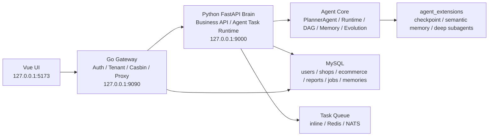
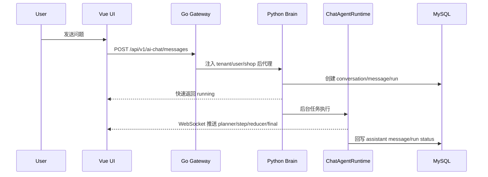
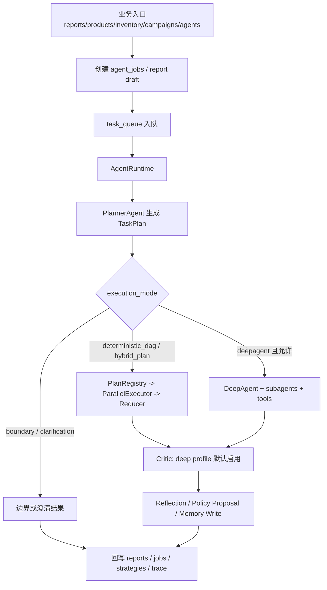
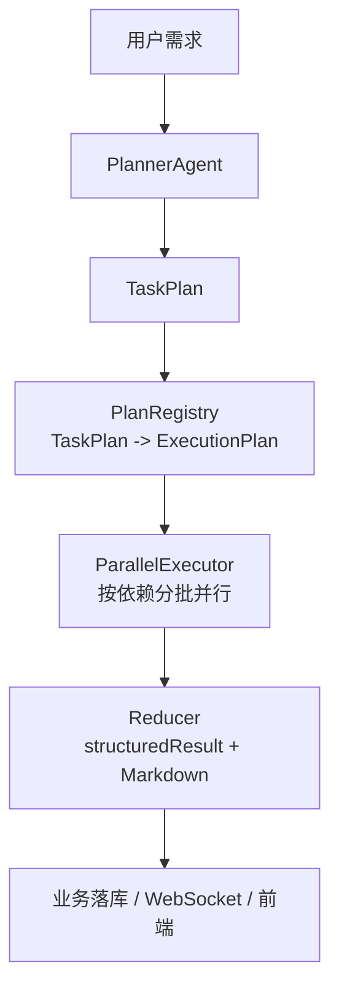
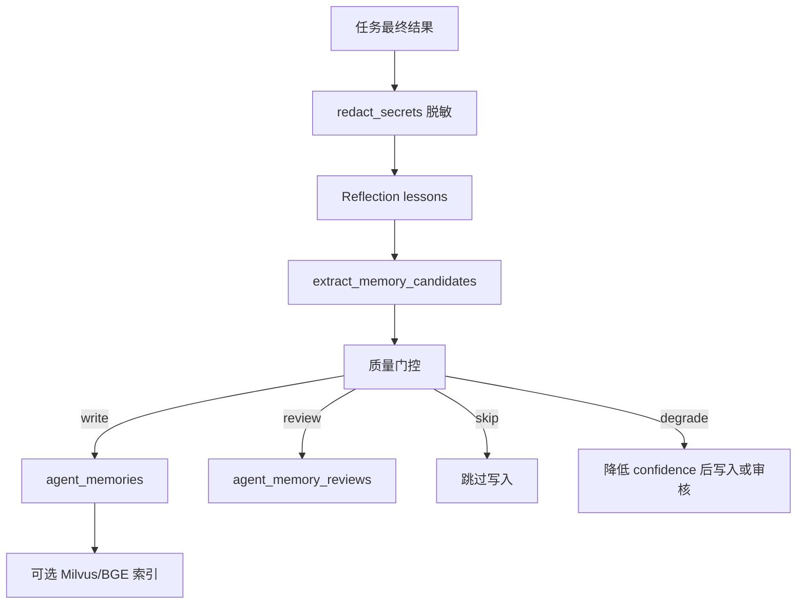
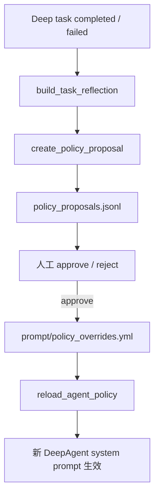

# EcommerceAgent

EcommerceAgent 是一个面向电商运营场景的数字员工平台。项目的核心不是做一个简单聊天机器人，而是把用户体系、店铺数据、经营分析、PlannerAgent、多 Agent 执行、报告生成、策略审核、记忆系统和前端可视化串成一套可商业化落地的 SaaS 原型。

项目当前已经具备：

- Go Gateway 负责注册登录、JWT、租户/店铺上下文、Casbin 权限和 API 代理。
- Python FastAPI Brain 负责电商业务 API、数据导入、AI Chat、数字员工任务、报告和策略落库。
- Agent 模块负责顶层规划、DAG 拆解、并行执行、DeepAgent fallback、Critic、记忆、反思和持续进化。
- Vue 前端提供工作台、AI 对话、数据导入、商品分析、库存风险、活动复盘、报告中心、数字员工和个人中心。
- MySQL 承载用户、租户、店铺、经营数据、AI Chat、Agent job、报告、策略和长期记忆。

## 1. 总体架构



### 分层职责

| 层级 | 目录 | 主要职责 |
| --- | --- | --- |
| 前端应用 | `ui/` | Vue 3 + TypeScript + Vite，负责用户界面、AI 对话、Agent 进度、报告和经营数据展示。 |
| 网关层 | `gateway/` | 注册登录、JWT、MySQL 用户存储、租户/店铺上下文、Casbin 权限、Brain API 代理和 WebSocket 代理。 |
| Python Brain | `api/` | FastAPI 业务 API、数据导入、工作台聚合、AI Chat 持久化、Agent 队列、报告和策略回写。 |
| Agent 核心 | `agent/` | PlannerAgent、TaskPlan、DAG 执行、Reducer、DeepAgent runtime、Critic、Memory、Reflection、Evolution、Trace。 |
| Agent 扩展 | `agent_extensions/` | deep profile 才启用的 checkpoint、语义记忆、知识库 subagent、网络搜索 subagent。 |
| 工具层 | `tools/` | 数据库工作流、文件读取、Markdown/PDF、RAGFlow、Tavily 等工具封装。 |
| 数据和脚本 | `data/`、`scripts/` | MySQL schema、示例数据、数据重置、smoke 测试、性能测试和模块审计。 |

## 2. 核心执行链路

### 2.1 AI Chat 链路

AI Chat 面向用户实时交互，要求快、可观测、不卡 UI。



AI Chat 使用 `agent/chat_agent_runtime.py`，特点：

- 不同步构建 DeepAgent。
- 不默认执行 Critic。
- 不默认写长期记忆。
- 优先走 PlannerAgent + deterministic / hybrid plan。
- 超出能力时返回 boundary answer。
- 缺少上下文时返回 clarification。

### 2.2 数字员工和报告链路

数字员工、商品分析、库存补货、活动复盘、报告生成等后台任务走 `AgentRuntime`。



## 3. Agent 模块详解

Agent 是项目最重要的部分。当前实现遵循一个原则：**顶层规划一次性结构化，执行层尽可能并行，DeepAgent 只做受控 fallback**。

### 3.1 目录结构

| 文件或目录 | 作用 |
| --- | --- |
| `agent/planning/planner_agent.py` | 顶层 PlannerAgent，接收原始需求，输出 TaskPlan/DAG/ExpertRoute。 |
| `agent/planning/schemas.py` | TaskIntent、TaskPlan、PlanStep、PlanEdge、ExpertRoute 等结构。 |
| `agent/chat_agent_runtime.py` | AI Chat 轻量运行时。 |
| `agent/main_agent.py` | DeepAgent 构建入口，懒加载模型、工具、subagent 和 checkpoint。 |
| `agent/runtime/agent_runtime.py` | 深度任务编排器，负责 plan、execute、critic、persist、memory、trace。 |
| `agent/runtime/plan_registry.py` | 把 TaskPlan 转成可执行 ExecutionPlan，也保留固定能力计划。 |
| `agent/runtime/parallel_executor.py` | 按 DAG 依赖并行或分批执行经营数据查询 step。 |
| `agent/runtime/reducer.py` | 把 step result 汇总成 structuredResult 和 Markdown 答案。 |
| `agent/runtime/result_pipeline.py` | Critic、反思、策略候选、记忆写入、失败/取消处理。 |
| `agent/runtime/profiles.py` | realtime、standard、deep 三档 runtime profile 和预算。 |
| `agent/runtime/budget.py` | 模型调用、工具调用、subagent 调用和 wall time 预算。 |
| `agent/runtime/agent_runner.py` | DeepAgent 流式执行、工具计数、循环检测和反思重试。 |
| `agent/workflows/business_metrics.py` | 电商经营指标查询口径。 |
| `agent/workflows/workflow_runner.py` | workflow 统一入口，优先执行 TaskPlan/DAG，必要时 fallback。 |
| `agent/critic/` | Critic 策略和模型评审。 |
| `agent/memory/` | 长期记忆、候选提取、MySQL 存储、检索和记忆审核。 |
| `agent/evolution/` | 任务反思和策略进化候选。 |
| `agent/observability/` | trace、timeline、metrics、slow task 分析。 |
| `agent/diagnostics/` | 单任务诊断。 |
| `agent/security/` | prompt guard、权限、脱敏。 |
| `agent/sub_agents/database_query_agent.py` | 数据库经营分析 subagent。 |

### 3.2 PlannerAgent 顶层规划

`PlannerAgent` 是全局调度大脑。它只做规划，不执行工具、不写 SQL、不计算经营指标。

核心职责：

1. 解析用户需求：目标、约束、输出格式、时间范围、风险、是否缺上下文。
2. 生成 TaskPlan：决定执行模式、step、依赖、Expert 路由、fallback 策略。
3. 拆解 DAG：把复杂需求拆成可以并行或串行执行的原子 step。
4. 路由 Expert：商品、库存、活动、报告、数据质量、通用 deep agent。
5. 控制边界：realtime 禁止同步 DeepAgent，超出电商能力返回 boundary，需要信息返回 clarification。
6. 支持重规划：Critic 或执行失败后可基于失败 step 和缺失数据生成修正计划。

#### TaskPlan 结构

PlannerAgent 输出 `TaskPlan`，核心字段包括：

| 字段 | 说明 |
| --- | --- |
| `plan_id` | 计划 ID。 |
| `raw_query` | 用户原始问题。 |
| `intent` | 标准化意图，包括 primary_goal、constraints、risk_level、confidence。 |
| `profile` | realtime / standard / deep。 |
| `execution_mode` | deterministic_dag / hybrid_plan / deepagent / boundary。 |
| `steps` | 原子执行步骤。 |
| `dependencies` | DAG 依赖边。 |
| `expected_output` | 期望输出说明。 |
| `missing_context` | 缺失上下文。 |
| `requires_clarification` | 是否需要澄清。 |
| `clarification_questions` | 澄清问题。 |
| `expert_routes` | Expert 路由声明。 |
| `confidence` | 规划置信度。 |

#### 三层规划策略

PlannerAgent 不完全依赖大模型，而是三层结合：

1. **CapabilityRegistry**  
   集中声明当前系统支持的电商能力，例如爆品分析、商品优化、库存分析、补货计划、活动复盘、日报、周报、季节选品、数据质量、平台授权。

2. **Fast Model JSON Planning**  
   使用 fast model 输出严格 JSON TaskPlan。它只规划，不执行，不编造不存在的 expert/tool/step。realtime 默认短 timeout。

3. **Deterministic Fallback**  
   模型不可用、超时或 JSON 解析失败时，基于 CapabilityRegistry 的 aliases/examples 生成确定性 TaskPlan。这样常见电商问题不会因为模型波动而不可用。

### 3.3 Plan-first DAG 执行

传统多 Agent 慢，常见原因是主 Agent 串行决策：想一步、调工具、等结果、再想下一步。项目现在把高频电商任务改成 Plan-first DAG：



执行策略：

- 没有依赖的 step 并行执行。
- 有依赖的 step 按拓扑分批执行。
- 每个 step 有独立 timeout。
- 整体计划有 global timeout。
- 非关键 step 失败会进入 missingData，不阻塞整体结果。
- 关键 step 失败时由 runtime profile 决定降级或 DeepAgent fallback。

### 3.4 Runtime Profile

| Profile | 典型场景 | 行为 |
| --- | --- | --- |
| `realtime` | AI Chat | 快速受理，后台执行，禁止同步 DeepAgent，优先 deterministic/hybrid plan。 |
| `standard` | 普通数字员工和报告 | 可执行 DAG，默认不进入 DeepAgent fallback，除非显式开启。 |
| `deep` | 深度分析任务 | 允许 DeepAgent fallback，启用 Critic、反思、记忆写入和策略进化。 |

预算由 `agent/runtime/profiles.py` 和 `agent/runtime/budget.py` 控制，包括：

- 最大 wall time。
- 最大模型调用次数。
- 最大工具调用次数。
- 最大 subagent 调用次数。
- 最大反思重试次数。
- 是否允许网络搜索。
- 是否允许记忆写入。
- 是否允许策略进化。

## 4. 记忆系统

记忆系统位于 `agent/memory/`，目标是让 Agent 能沉淀用户偏好、任务经验和工具使用经验，但不能把过期经营数据、错误结论或高风险策略直接污染长期上下文。

### 4.1 记忆分层

项目里有两类记忆：

1. **运行事件记忆**  
   位于 `data/memory/task_events.jsonl` 和 `data/memory/reflections.jsonl`。  
   这是轻量运行日志，用于审计、诊断、反思和策略候选，不等于长期语义记忆。

2. **长期语义记忆**  
   主存储在 MySQL 的 `agent_memories` 和 `agent_memory_reviews`。  
   可选接入 Milvus/BGE 做向量索引，但权限过滤和最终读取仍回到 MySQL。

### 4.2 MemoryIdentity

`MemoryIdentity` 描述一条记忆属于谁：

```text
tenant_id
user_id
shop_id
conversation_id
task_id
```

所有记忆读写都必须带身份上下文，避免跨租户、跨用户、跨店铺污染。

### 4.3 MemoryCandidate

`MemoryCandidate` 是待写入或待审核的候选记忆，字段包括：

| 字段 | 说明 |
| --- | --- |
| `memory_type` | 记忆类型，例如 user_preference、task_lesson、tool_lesson。 |
| `content` | 记忆正文，写入前会脱敏。 |
| `scope` | user / shop / global。 |
| `confidence` | 置信度。 |
| `importance` | 重要性。 |
| `tags` | 检索标签。 |
| `requires_review` | 是否需要人工审核。 |
| `source_type` | 来源，例如 user_request、task_result。 |

候选记忆通过稳定哈希 ID 做 upsert，避免同一偏好或经验重复写入多条。

### 4.4 写入流程



写入入口在 `agent/memory/writer.py`：

1. `result_pipeline.write_memory()` 传入 query、final_result、reflection lessons 和 execution_metadata。
2. `extract_memory_candidates()` 提取候选。
3. `_memory_quality_action()` 根据执行质量决定 write / review / skip / degrade。
4. `MySQLMemoryStore` 写入 MySQL 或审核队列。
5. 如果语义索引可用，再写入 Milvus。

### 4.5 提取策略

当前提取器是规则型，刻意保守：

- 明确用户偏好才写 `user_preference`。
- 任务复盘 lessons 可写 `task_lesson`。
- 数据库状态机、循环治理等经验可写 `tool_lesson`。
- 不把完整经营报告、具体订单、短期商品结论直接写成长记忆，避免过期数据污染后续任务。

### 4.6 质量门控策略

记忆写入会根据 execution metadata 做质量判断：

| 情况 | 策略 |
| --- | --- |
| 无错误且 Critic 通过 | 正常写入。 |
| `workflow_section_errors` | 大多数任务经验跳过，工具经验可降置信度写入。 |
| `critic_failed` | 高风险或业务结论类记忆跳过，避免错误固化。 |
| 用户偏好 | 即使任务质量一般，也可写入，因为它来自用户显式表达。 |
| 高风险内容 | 进入 `agent_memory_reviews` 人工审核。 |

### 4.7 检索策略

检索入口在 `agent/memory/retriever.py`：

1. 如果 `agent_extensions.semantic_memory` 可用，先查 Milvus/BGE。
2. 命中 memory_id 后回到 MySQL 按 tenant/user/shop 过滤。
3. 如果向量检索不可用，使用 MySQL LIKE fallback。
4. 如果关键词搜不到，回退到高 importance、高 confidence 的近期记忆。

检索结果会被格式化为长期记忆上下文，并注入深度任务的 prompt。AI Chat realtime 不默认写记忆，避免热路径变慢。

## 5. 反思节点

反思逻辑位于 `agent/evolution/reflection.py` 和 `agent/runtime/result_pipeline.py`。

### 5.1 反思何时触发

当前策略：

- deep profile 成功任务：生成成功 reflection。
- deep profile 失败任务：生成失败 reflection。
- cancelled / loop failure / graph recursion / runtime error：统一进入失败反思。
- realtime / standard 默认延后，不阻塞用户可见结果。

### 5.2 反思内容

成功任务反思记录：

- 任务输入摘要。
- 输出摘要。
- 可复用经验。
- 后续类似任务可参考的行为。

失败任务反思记录：

- 错误原因。
- 外部工具、文件、subagent、模型或数据源排查方向。
- 后续重试或规划优化建议。

反思结果会写入：

- `data/memory/reflections.jsonl`
- `data/memory/task_events.jsonl`
- 策略候选生成器
- 长期记忆候选提取器

## 6. 持续进化机制

持续进化不等于让 Agent 自动改 prompt。项目采用“候选生成 + 人工审核 + prompt override”的安全策略。



### 6.1 策略候选

`agent/evolution/policy_review.py` 会把 reflection 转成 policy proposal：

- `proposal_id`
- `status`
- `target`
- `task_query`
- `rationale`
- `instruction`
- `created_at`
- `reviewed_at`

候选先写入 `data/memory/policy_proposals.jsonl`。

### 6.2 人工审核

通过 API 可以 approve / reject：

- approve：追加写入 `prompt/policy_overrides.yml`。
- reject：只更新候选状态，不影响系统 prompt。

这样 Agent 可以沉淀经验，但不会在无人审核的情况下自动改变核心行为。

### 6.3 热重载

`agent/main_agent.py` 提供 `reload_agent_policy()`：

- 重新加载 prompts。
- 清空 DeepAgent 缓存。
- 下一次 deep task 构建时加载新的 policy override。

## 7. Critic 评审

Critic 位于 `agent/critic/`。

### 7.1 触发策略

Critic 不是每个任务都跑。是否需要 Critic 由 `agent/critic/policy.py` 判断，参考：

- runtime profile。
- TaskPlan 风险。
- 工具调用情况。
- 是否涉及写操作候选。
- 是否是高价值经营建议。

### 7.2 执行方式

`result_pipeline.run_critic_stage()` 会：

1. 判断 Critic 是否启用。
2. 判断 policy 是否要求评审。
3. 调用 `run_critic()`。
4. 如果不通过，最多触发一次受控修正重跑。
5. 仍失败则把 Critic issues 附加到最终结果。

这样避免 Critic 和 Agent 互相无限重跑。

## 8. DeepAgent 与 Subagents

DeepAgent 只在 `standard` 受控 fallback 或 `deep` profile 中构建。

默认 subagent：

- `database_query_agent`：数据库经营分析专家。

可选 deep subagents 位于 `agent_extensions/deep_subagents/`：

- `knowledge_base_agent`：RAGFlow 知识库。
- `network_search_agent`：Tavily 网络搜索。

它们默认不进入实时热路径，需要通过环境变量显式启用：

```env
DEEP_AGENT_ENABLE_KNOWLEDGE_BASE=false
DEEP_AGENT_ENABLE_NETWORK_SEARCH=false
```

## 9. 模型路由

项目只保留两档模型：

```env
LLM_FAST_MODEL=gpt-5.4-mini
LLM_DEEP_MODEL=gpt-5.5
LLM_FAST_TIMEOUT_SECONDS=8
LLM_FAST_MAX_RETRIES=1
LLM_DEEP_TIMEOUT_SECONDS=60
LLM_DEEP_MAX_RETRIES=1
```

| Profile | 模型 | 用途 |
| --- | --- | --- |
| `fast_model` | `gpt-5.4-mini` | Planner、AI Chat、Reducer 润色、轻量总结。 |
| `standard_model` | `gpt-5.4-mini` | 标准数字员工、数据库 workflow、普通报告。 |
| `critic_model` | `gpt-5.4-mini` | Critic 和监督检查。 |
| `deep_model` | `gpt-5.5` | deep profile 的 DeepAgent。 |

## 10. Python Brain 模块

| 模块 | 说明 |
| --- | --- |
| `api/server.py` | FastAPI 入口、WebSocket、任务队列启动和 Agent task 分发。 |
| `api/routes/ai_chat.py` | AI Chat conversation/message/run API。 |
| `api/routes/reports.py` | 报告生成和详情查询。 |
| `api/routes/products.py` | 商品列表和商品分析任务。 |
| `api/routes/inventory.py` | 库存风险和补货计划任务。 |
| `api/routes/campaigns.py` | 活动复盘。 |
| `api/routes/data_import.py` | 示例、上传、粘贴导入。 |
| `api/services/ai_chat_service.py` | AI Chat MySQL 持久化。 |
| `api/services/agent_job_service.py` | Agent job 创建、状态同步、结果报告关联。 |
| `api/services/job_result_service.py` | Agent 完成后业务落库。 |
| `api/services/ecommerce_queries.py` | 工作台、商品、库存、活动、策略等查询口径。 |
| `api/task_queue.py` | inline / Redis / NATS 队列和并发控制。 |
| `api/task_runtime.py` | 任务状态、取消、结果缓存。 |
| `api/monitor.py` | WebSocket manager 和 Agent 进度事件。 |

## 11. Go Gateway 模块

| 模块 | 说明 |
| --- | --- |
| `gateway/cmd/server/` | Go 服务启动入口。 |
| `gateway/internal/auth/` | MySQL 用户存储、JWT、用户/租户/店铺关系。 |
| `gateway/internal/authorization/` | Casbin 权限模型。 |
| `gateway/internal/middleware/` | Auth、Tenant、Request ID、CORS。 |
| `gateway/internal/proxy/` | Brain HTTP/WebSocket 代理。 |
| `gateway/internal/router/` | `/api/v1` 路由。 |
| `gateway/configs/casbin/` | 权限模型和默认策略。 |

Gateway 默认使用 MySQL 用户存储。商业化模式不使用 JSON 用户文件。

## 12. 前端模块

| 模块 | 说明 |
| --- | --- |
| `ui/src/App.vue` | 主应用页面和交互。 |
| `ui/src/services/platformApi.ts` | Gateway API 和 WebSocket 调用封装。 |
| `ui/src/types.ts` | 前端类型。 |
| `ui/src/style.css` | 页面样式。 |

主要页面：

- 登录 / 注册 / onboarding。
- 工作台。
- AI 对话和 Agent 状态面板。
- 数据导入。
- 商品分析。
- 库存风险。
- 活动复盘。
- 报告中心。
- 数字员工。
- 个人中心。

## 13. 数据表和持久化

核心数据保存在 MySQL：

| 领域 | 表 |
| --- | --- |
| 用户和租户 | `gateway_users`、`gateway_tenants`、`gateway_shops`、`gateway_user_tenants`、`gateway_user_shops` |
| 电商经营 | orders、order_items、products、inventory、traffic、campaigns、refunds 等 |
| Agent job | `agent_jobs` |
| 报告 | `business_reports` |
| 策略 | `strategy_reviews` |
| AI Chat | `ai_chat_conversations`、`ai_chat_messages`、`ai_chat_runs` |
| 长期记忆 | `agent_memories`、`agent_memory_reviews` |

Schema 和脚本：

- `data/ecommerce_demo/schema.sql`
- `data/ecommerce_demo/platform_schema.sql`
- `data/ecommerce_demo/tenant_shop_migration.sql`
- `data/ecommerce_demo/seed_ecommerce_demo.py`

## 14. 环境要求

- Windows PowerShell 5.1 或 PowerShell 7。
- Python 3.11+。
- Go 1.22+。
- Node.js 20+。
- MySQL 8+。
- 可选：Redis、NATS、Milvus。

## 15. 环境变量

复制示例文件：

```powershell
Copy-Item .env.example .env
```

关键配置：

```env
OPENAI_BASE_URL=https://api.openai.com/v1
OPENAI_API_KEY=your-api-key
LLM_PROVIDER=openai
LLM_FAST_MODEL=gpt-5.4-mini
LLM_DEEP_MODEL=gpt-5.5

MYSQL_HOST=localhost
MYSQL_PORT=3306
MYSQL_USER=root
MYSQL_PASSWORD=your-password
MYSQL_DATABASE=ecommerce_demo

PYTHON_BRAIN_URL=http://127.0.0.1:9000
GATEWAY_ADDR=:9090
GATEWAY_USER_STORE_BACKEND=mysql
GATEWAY_JWT_SECRET=dev-only-change-me

VITE_API_BASE_URL=http://127.0.0.1:9090
VITE_WS_BASE_URL=ws://127.0.0.1:9090
```

`.env` 不提交到 Git。

## 16. 启动方式

首次安装依赖并启动：

```powershell
.\start-dev.cmd -Install
```

日常启动：

```powershell
.\scripts\start-dev.ps1
```

默认地址：

| 服务 | 地址 |
| --- | --- |
| Vue UI | `http://127.0.0.1:5173` |
| Go Gateway | `http://127.0.0.1:9090` |
| Python Brain | `http://127.0.0.1:9000` |
| Gateway health | `http://127.0.0.1:9090/health` |

### 手动启动

Python Brain：

```powershell
.\.venv\Scripts\python.exe -m uvicorn api.server:app --host 127.0.0.1 --port 9000
```

Go Gateway：

```powershell
$env:PYTHON_BRAIN_URL="http://127.0.0.1:9000"
$env:GATEWAY_ADDR=":9090"
go run ./gateway/cmd/server
```

Vue UI：

```powershell
Push-Location ui
npm install
npm run dev
Pop-Location
```

## 17. 验证命令

Python 编译：

```powershell
.\.venv\Scripts\python.exe -B -m compileall api agent agent_extensions tools
```

PlannerAgent smoke：

```powershell
.\.venv\Scripts\python.exe scripts\smoke_planner_agent.py
```

Go 测试：

```powershell
go test ./gateway/...
```

前端构建：

```powershell
Push-Location ui
npm run build
Pop-Location
```

端到端 smoke：

```powershell
$env:GATEWAY_URL='http://127.0.0.1:9090'
.\scripts\smoke_e2e.ps1
```

Agent 性能 smoke：

```powershell
.\scripts\smoke_agent_performance.ps1
```

## 18. 常用脚本

| 脚本 | 功能 |
| --- | --- |
| `scripts/start-dev.ps1` | 启动 Brain、Gateway、UI。 |
| `scripts/smoke_e2e.ps1` | Gateway 端到端 smoke。 |
| `scripts/smoke_agent_performance.ps1` | Agent 性能 smoke。 |
| `scripts/smoke_planner_agent.py` | PlannerAgent 规划、边界、澄清和 fallback smoke。 |
| `scripts/smoke_fresh_eval.ps1` | 全新评测 smoke。 |
| `scripts/reset_dev_data.ps1` | 清理开发测试数据。 |
| `scripts/prepare_fresh_eval.ps1` | 准备全新评测环境。 |
| `scripts/generate_sample_orders.ps1` | 生成样例订单数据。 |
| `scripts/audit_agent_modules.ps1` | Agent 模块审计。 |

## 19. 观测和排障

Agent 运行事件会进入 trace，并通过 WebSocket 推给前端。

重点事件：

- `planner_started`
- `planner_finished`
- `plan_execution_started`
- `plan_step_started`
- `plan_step_finished`
- `reducer_started`
- `reducer_finished`
- `critic_policy_evaluated`
- `critic_skipped`
- `memory_write_started`
- `memory_write_finished`
- `agent_finished`

常见问题：

| 问题 | 排查方向 |
| --- | --- |
| AI Chat 慢 | 看是否误入 DeepAgent；检查 planner timeout、workflow step timeout、WebSocket timeline。 |
| DeepAgent 慢 | 检查网络搜索、知识库、checkpoint、Critic、memory write 是否开启。 |
| 数据为空 | 检查 tenant/shop 是否和导入数据一致。 |
| 前端不刷新 | 检查 `/api/v1/ws/{thread_id}`，必要时通过 timeline/message 补拉。 |
| 记忆不生效 | 检查 `agent_memories`、`agent_memory_reviews`、memory write trace 和 identity scope。 |
| 策略没有进化 | 检查 deep profile 是否执行、`policy_proposals.jsonl` 是否产生、是否已 approve。 |

## 20. 开发原则

- AI Chat 不同步拉起 DeepAgent。
- 常见电商任务优先走 PlannerAgent + Plan-first DAG。
- DeepAgent 只作为 deep profile 或受控 fallback。
- 长期记忆必须经过脱敏、质量门控和租户隔离。
- 高风险记忆和策略必须人工审核。
- 策略进化采用 proposal/approve 模式，不允许自动改写核心 prompt。
- `agent_extensions/` 默认关闭，只在 deep profile 或显式开关启用。
- `.env`、运行日志、缓存、构建产物不提交。

## 21. 当前商业化闭环

已闭环能力：

- 注册、登录、JWT、MySQL 用户存储。
- 租户、店铺、onboarding。
- 示例数据、CSV/Excel、粘贴数据导入。
- 工作台经营指标、商品、库存、活动、策略和报告。
- AI Chat 异步受理、PlannerAgent、WebSocket 进度、最终答案回写。
- 数字员工任务、报告生成、商品分析、库存补货、活动复盘。
- Agent job 状态同步和业务报告回写。
- Critic、Reflection、Memory、Policy Proposal。
- Runtime metrics、slow tasks、diagnosis。

建议继续增强：

- 浏览器自动化验收。
- 更完整的 token streaming。
- 生产级队列和 Worker 部署。
- 多平台授权后的实时拉数。
- 慢 SQL 监控和索引优化。
- 策略进化审核后台 UI。
