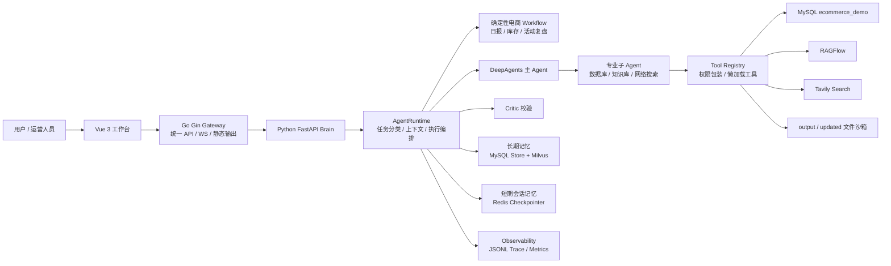

# EcommerceAgent 电商运营数字员工

EcommerceAgent 是一个面向电商运营场景的本地多 Agent 项目。它把 Vue 工作台、Go Gin 网关、Python FastAPI 大脑、DeepAgents/LangGraph、MySQL 电商经营数据、Redis checkpoint、Milvus 长期向量记忆、RAGFlow 知识库和 Tavily 搜索组合在一起，用来完成经营日报、库存预警、活动复盘、爆品分析、退款异常分析、知识库问答和报告生成等运营任务。

项目当前定位是：**本地快速落地版 + 可继续演进的多 Agent 架构底座**。因此代码优先保证链路清晰、可运行、可观测、可扩展，而不是一开始就做复杂的分布式平台。

## 架构总览



默认请求链路：

```text
Vue UI http://127.0.0.1:5173
  -> Go Gateway http://127.0.0.1:9090
  -> Python Brain http://127.0.0.1:9000
  -> AgentRuntime
  -> deterministic workflow 或 DeepAgent fallback
  -> Critic / memory / trace / 文件产物
```

## 核心能力

- **电商运营工作台**：聊天式任务输入、快捷任务、文件上传、实时执行日志、产物侧边栏和下载。
- **多 Agent 协作**：主 Agent 负责理解任务和调度，数据库、知识库、网络搜索由专业子 Agent 执行。
- **确定性 Workflow 优先**：经营日报、库存风险、活动复盘等高频任务优先走固定业务流程；未覆盖或失败时回落 DeepAgent。
- **统一工具注册表**：工具集中注册元数据、风险等级、权限点和懒加载工厂，Agent 只引用稳定工具名。
- **短期会话记忆**：LangGraph checkpoint 默认使用 Redis；Redis 不可用时自动降级为 MemorySaver。
- **长期记忆系统**：MySQL 存储结构化记忆，Milvus 做语义召回；高风险记忆候选进入人工审核。
- **Critic 质量校验**：根据任务类型、风险和工具调用决定是否运行 Critic，并支持最多一次受控修正。
- **任务队列与运行态管理**：支持 inline、Redis、NATS 队列；限制并发，维护 queued/running/interrupted/cancelling/succeeded/failed 状态。
- **文件沙箱**：上传文件复制到会话工作目录，工具读写被限制在当前 session 目录内。
- **观测与治理**：记录 LLM 调用、工具调用、记忆读写、Critic、任务生命周期和 Agent 指标。
- **策略进化**：任务完成后生成反思和策略建议，经审核后写入策略覆盖并热重载 Prompt。

## 目录结构

```text
agent/
  core/                 LLM Router、Tool Registry、DB 基础层、Runtime Context、AgentSpec
  runtime/              AgentRuntime、执行 runner、结果流水线、任务上下文、ExecutionResult
  workflows/            确定性电商 workflow：日报、库存预警、活动复盘等
  memory/               Redis checkpoint、MySQL Store、Milvus 向量记忆、记忆抽取和写入
  critic/               Critic Agent 和触发策略
  security/             权限检查、PromptGuard、敏感信息脱敏
  observability/        JSONL trace、事件结构、trace reader 和指标聚合
  sub_agents/           数据库、知识库、网络搜索子 Agent
  evolution/            任务反思和策略建议审核
  main_agent.py         DeepAgents 图构建和 run_deep_agent 兼容入口

api/
  server.py             FastAPI Brain：任务、文件、记忆、策略、trace API 和 WebSocket
  task_queue.py         inline / Redis / NATS 队列适配
  task_runtime.py       任务状态、取消、恢复和会话并发控制
  monitor.py            WebSocket 事件推送

gateway/
  cmd/server/           Go 网关启动入口
  internal/router/      /api/v1 路由和兼容路由
  internal/proxy/       Python Brain 反向代理
  internal/middleware/  CORS、request id

tools/
  db_tools.py           暴露给 Agent 的数据库工具 wrapper
  database_workflow_tool.py 数据库分析/写入候选工作流
  markdown_tools.py     Markdown 产物生成
  pdf_tools.py          Markdown 转 PDF
  upload_file_read_tool.py 上传文件读取
  ragflow_tools.py      RAGFlow 知识库工具
  tavily_tool.py        网络搜索工具

ui/
  src/App.vue           Vue 工作台主界面
  vite.config.ts        前端开发配置

data/ecommerce_demo/
  schema.sql            演示库表结构
  seed_ecommerce_demo.py Olist 数据导入和运营模拟数据生成

prompt/
  prompts.yml           主 Agent、子 Agent 和策略 Prompt

utils/
  path_utils.py         文件沙箱路径解析
  word_converter.py     文档转换辅助

scripts/start-dev.ps1   Windows 一键开发启动脚本
start-dev.cmd           CMD 包装启动入口
```

## 关键执行流程

### 1. 任务创建

前端提交任务到 Go Gateway，网关转发到 Python Brain：

```text
POST /api/v1/tasks
```

Python 端生成或复用 `conversation_id`，为本次执行生成 `task_id`，写入 `TaskRuntime`，再投递到 `TaskQueue`。

### 2. 运行时准备

`AgentRuntime.prepare_context()` 会完成：

- PromptGuard 检查和标记；
- 电商任务分类；
- 创建 `output/session_{conversation_id}` 工作目录；
- 复制 `updated/session_{conversation_id}` 中的上传文件；
- 设置 session、thread、identity ContextVar；
- 构造 LangGraph config；
- 召回长期记忆并拼入工作环境提示。

### 3. 执行调度

`WorkflowRunner` 会根据分类结果优先选择确定性 workflow：

- `daily_report`
- `inventory_analysis`
- `campaign_review`

如果任务不适合 workflow、workflow 未覆盖或执行失败，则回落到 DeepAgent 主图。

### 4. 质量和记忆闭环

任务执行完成后统一进入：

```text
Critic -> reflection -> memory write -> trace finalize
```

其中：

- Critic 只对高风险或高价值任务触发；
- 反思写入本地 task events/reflections；
- 长期记忆候选写入 MySQL，必要时进入人工审核；
- Milvus 可用时同步写入向量索引；
- Trace 记录完整生命周期，供排障和指标聚合使用。

## 环境要求

基础环境：

- Windows PowerShell 5.1+
- Python 3.12+
- Go 1.22+ 或项目当前 `go.mod` 支持的版本
- Node.js 20+
- MySQL 8.x 或兼容版本

推荐本地服务：

- Redis：用于 LangGraph checkpoint，也可作为任务队列后端。
- Milvus：用于长期记忆语义检索。
- RAGFlow：用于知识库问答。
- Tavily：用于外部搜索。

Redis 不可用时 checkpoint 会自动降级为内存；Milvus 不可用时长期记忆会回退到 MySQL LIKE 检索。

## 环境变量

在项目根目录创建 `.env`。不要提交真实密钥。

```env
# LLM Backend，兼容 OpenAI 协议
OPENAI_BASE_URL=https://dashscope.aliyuncs.com/compatible-mode/v1
OPENAI_API_KEY=your-api-key
LLM_MODEL=qwen-max
LLM_PROVIDER=openai
LLM_TIMEOUT_SECONDS=180
LLM_MAX_RETRIES=3
LLM_TEMPERATURE=0.2

# 可选：不同阶段独立模型配置
FAST_LLM_MODEL=qwen-turbo
REASONING_LLM_MODEL=qwen-max
CRITIC_LLM_MODEL=qwen-max

# MySQL
MYSQL_HOST=localhost
MYSQL_PORT=3306
MYSQL_USER=root
MYSQL_PASSWORD=your-password
MYSQL_DATABASE=ecommerce_demo
MYSQL_CHARSET=utf8mb4
MYSQL_COLLATION=utf8mb4_unicode_ci

# Redis checkpoint / Redis queue
CHECKPOINTER_BACKEND=redis
REDIS_URL=redis://localhost:6379/0

# Milvus memory vector backend
MEMORY_VECTOR_BACKEND=milvus
MILVUS_HOST=localhost
MILVUS_PORT=19530
MEMORY_MILVUS_COLLECTION=agent_memories

# Task queue: inline / redis / nats
TASK_QUEUE_BACKEND=inline
TASK_QUEUE_NAME=deepagent.tasks
MAX_AGENT_CONCURRENCY=2
NATS_URL=nats://localhost:4222

# RAGFlow，可选
RAGFLOW_API_URL=http://your-ragflow-host
RAGFLOW_API_KEY=your-ragflow-key

# Tavily，可选
TAVILY_API_KEY=your-tavily-key

# Critic，可选
CRITIC_ENABLED=true
CRITIC_MAX_REVISIONS=1

# 数据库写入保护，可选
DB_ALLOW_DANGEROUS_DDL=false
DB_ENABLE_PRODUCTION_MERGE=false
```

手动启动 Go 网关和前端时常用：

```powershell
$env:PYTHON_BRAIN_URL="http://127.0.0.1:9000"
$env:GATEWAY_ADDR=":9090"
$env:OUTPUT_DIR="output"
$env:VITE_API_BASE_URL="http://127.0.0.1:9090"
$env:VITE_WS_BASE_URL="ws://127.0.0.1:9090"
```

## 安装依赖

首次启动推荐直接使用一键脚本：

```powershell
.\start-dev.cmd -Install
```

脚本会：

1. 创建或复用 `.venv`；
2. 安装 `requirements.txt`；
3. 执行 `go mod download`；
4. 在 `ui/` 下执行 `npm install`；
5. 启动 Python Brain、Go Gateway、Vue UI。

也可以手动安装：

```powershell
python -m venv .venv
.\.venv\Scripts\python.exe -m pip install -r requirements.txt
go mod download
Push-Location ui
npm install
Pop-Location
```

## 启动服务

### 一键启动

```powershell
.\start-dev.cmd
```

默认会启动三个窗口：

```text
EcomAgent - python-brain    http://127.0.0.1:9000
EcomAgent - go-gateway      http://127.0.0.1:9090
EcomAgent - vue-ui          http://127.0.0.1:5173
```

浏览器打开：

```text
http://127.0.0.1:5173
```

日志位置：

```text
.run-logs/
```

### 指定端口

```powershell
.\start-dev.cmd -PythonPort 19000 -GatewayPort 19090 -UiPort 15173
```

### 启动并导入演示库

```powershell
.\start-dev.cmd -SeedDemo
```

该参数会在启动前执行 `data/ecommerce_demo/seed_ecommerce_demo.py --reset --database ecommerce_demo`。

### 手动启动

Python Brain：

```powershell
.\.venv\Scripts\python.exe -m uvicorn api.server:app --host 127.0.0.1 --port 9000
```

Go Gateway：

```powershell
$env:PYTHON_BRAIN_URL="http://127.0.0.1:9000"
$env:GATEWAY_ADDR=":9090"
$env:OUTPUT_DIR="output"
go run ./gateway/cmd/server
```

Vue UI：

```powershell
Push-Location ui
$env:VITE_API_BASE_URL="http://127.0.0.1:9090"
$env:VITE_WS_BASE_URL="ws://127.0.0.1:9090"
npm run dev -- --host 127.0.0.1 --port 5173
Pop-Location
```

健康检查：

```powershell
Invoke-RestMethod http://127.0.0.1:9090/health
```

## 本地 Redis / Milvus

如果你在 Windows 上使用 Docker，可以用 Redis 作为 checkpoint：

```powershell
docker run --name ecommerce-agent-redis -p 6379:6379 -d redis:7
```

验证：

```powershell
.\.venv\Scripts\python.exe -c "import redis; r=redis.Redis.from_url('redis://localhost:6379/0'); print(r.ping())"
```

Milvus 需要的组件更多，建议使用 Milvus 官方 Docker Compose。Milvus 暂时不可用也不影响主流程，系统会回退到 MySQL 检索。

## 电商演示数据库

项目使用 Olist Brazilian E-Commerce Public Dataset 作为订单基础，并生成库存、流量、活动、退款和客服工单等运营模拟数据。

把 Olist CSV 放到：

```text
data/olist/
```

应包含：

```text
olist_customers_dataset.csv
olist_orders_dataset.csv
olist_order_items_dataset.csv
olist_order_payments_dataset.csv
olist_order_reviews_dataset.csv
olist_products_dataset.csv
olist_sellers_dataset.csv
product_category_name_translation.csv
```

导入完整演示库：

```powershell
.\.venv\Scripts\python.exe .\data\ecommerce_demo\seed_ecommerce_demo.py --reset --database ecommerce_demo
```

快速烟测导入：

```powershell
.\.venv\Scripts\python.exe .\data\ecommerce_demo\seed_ecommerce_demo.py --reset --database ecommerce_demo --limit 1000
```

导入后会创建：

```text
customers
sellers
products
orders
order_items
payments
reviews
inventory
traffic_stats
campaigns
campaign_product_stats
refunds
customer_service_tickets
```

## API 概览

推荐使用 Go Gateway 的 `/api/v1` 路径。项目也保留了旧路径兼容前端和历史调用方。

| Method | Path | 说明 |
| --- | --- | --- |
| `GET` | `/health` | 网关健康检查 |
| `POST` | `/api/v1/tasks` | 创建任务 |
| `GET` | `/api/v1/tasks` | 查询任务列表 |
| `GET` | `/api/v1/tasks/{thread_id}` | 查询单个任务 |
| `POST` | `/api/v1/tasks/{thread_id}/cancel` | 取消任务 |
| `POST` | `/api/v1/tasks/{thread_id}/resume` | 恢复人工中断任务 |
| `POST` | `/api/v1/uploads` | 上传文件 |
| `GET` | `/api/v1/files` | 查询输出文件 |
| `GET` | `/api/v1/download` | 下载输出文件 |
| `GET` | `/api/v1/tools/catalog` | 查询工具目录 |
| `POST` | `/api/v1/memories/search` | 检索长期记忆 |
| `GET` | `/api/v1/memories/reviews` | 查询记忆审核候选 |
| `POST` | `/api/v1/memories/reviews/{id}/approve` | 通过记忆候选 |
| `POST` | `/api/v1/memories/reviews/{id}/reject` | 拒绝记忆候选 |
| `GET` | `/api/v1/policy/proposals` | 查询策略建议 |
| `POST` | `/api/v1/policy/proposals/{id}/approve` | 通过策略建议并热重载 |
| `POST` | `/api/v1/policy/proposals/{id}/reject` | 拒绝策略建议 |
| `GET` | `/api/v1/traces/{task_id}` | 查询原始 trace |
| `GET` | `/api/v1/traces/{task_id}/timeline` | 查询任务时间线 |
| `GET` | `/api/v1/metrics/agents` | 查询 Agent/工具聚合指标 |
| `WS` | `/api/v1/ws/{thread_id}` | 实时任务事件 |

创建任务示例：

```powershell
$body = @{
  query = "生成最近 7 天电商经营日报，包含 GMV、订单、客单价、退款和库存风险"
  tenant_id = "default_tenant"
  user_id = "local_user"
  shop_id = "default_shop"
} | ConvertTo-Json

Invoke-RestMethod `
  -Uri http://127.0.0.1:9090/api/v1/tasks `
  -Method Post `
  -ContentType "application/json" `
  -Body $body
```

查询任务：

```powershell
Invoke-RestMethod http://127.0.0.1:9090/api/v1/tasks/{thread_id}
```

取消任务：

```powershell
Invoke-RestMethod http://127.0.0.1:9090/api/v1/tasks/{thread_id}/cancel -Method Post
```

## 可以尝试的任务

```text
生成最近 7 天电商经营日报，包含 GMV、订单数、客单价、评分、退款和待处理客服风险。
```

```text
检查当前商品库存风险，识别低于安全库存、库存周转慢、销量下滑但库存较高的商品，并给出补货、清仓或活动建议。
```

```text
复盘最近一次电商活动，分析活动期间销售额、订单量、投放成本、ROI、参与商品表现、库存消耗和退款情况。
```

```text
分析近期退款率异常的商品或订单，定位可能的质量、物流、描述、客服或价格问题，并给出降低退款率的运营建议。
```

```text
请读取我上传的运营 SOP 文档，总结其中可以沉淀到知识库的 FAQ。
```

## 记忆系统说明

项目里有两层记忆：

### 短期会话记忆

- 文件：`agent/memory/checkpoint.py`
- 默认后端：Redis
- 用途：保存 LangGraph/DeepAgents 的会话 checkpoint，让同一 conversation 可延续上下文。
- 降级：Redis 不可用时自动使用 `MemorySaver`。

### 长期跨会话记忆

- Store：`agent/memory/store.py`
- Retriever：`agent/memory/retriever.py`
- Vector：`agent/memory/milvus_store.py`
- Schema：`agent/memory/schema.py`

写入流程：

```text
任务结果 -> reflection -> memory extractor -> candidate gate -> MySQL Store -> Milvus embedding
```

召回流程：

```text
任务开始 -> Milvus 语义召回 -> MySQL 按 id 取详情
       -> Milvus 不可用时回退 MySQL LIKE 检索
       -> 拼入工作环境提示
```

高风险或低置信度记忆候选会进入 `agent_memory_reviews`，需要通过 `/api/v1/memories/reviews/*` 审核后才写入正式记忆。

## 安全与权限

- `ToolRegistry` 为每个工具定义 category、risk、permissions 和 approval metadata。
- `permissions.py` 在工具执行前检查 Agent 是否拥有对应权限。
- `prompt_guard.py` 当前本地阶段以标记风险为主，不默认阻断。
- `redaction.py` 会在 trace、memory、reflection 写入前脱敏密钥和连接串。
- `path_utils.py` 将工具文件读写限制在当前 session 工作目录内。
- 数据库写入不直接暴露给 LLM，必须经过候选、沙箱或人工审核链路。

## 观测与排障

Trace 会记录：

- 任务开始/结束；
- LLM 调用耗时和 token；
- 工具调用；
- workflow 选择和 fallback；
- Critic 结果；
- memory retrieval/write；
- 失败原因。

常用接口：

```text
GET /api/v1/traces/{task_id}
GET /api/v1/traces/{task_id}/timeline
GET /api/v1/metrics/agents
```

运行日志：

```text
.run-logs/
```

运行产物：

```text
output/session_{conversation_id}/
```

上传文件：

```text
updated/session_{conversation_id}/
```

## 验证命令

Python 静态编译检查：

```powershell
.\.venv\Scripts\python.exe -B -m compileall agent api tools utils data\ecommerce_demo
```

Go 测试：

```powershell
go test ./gateway/...
```

前端构建：

```powershell
Push-Location ui
npm run build
Pop-Location
```

Redis checkpoint 验证：

```powershell
.\.venv\Scripts\python.exe -c "from agent.memory.checkpoint import build_checkpointer; print(type(build_checkpointer()).__name__)"
```

Python Brain 导入验证：

```powershell
.\.venv\Scripts\python.exe -c "from api.server import app; print(app.title)"
```

## 常见问题

### PowerShell 不允许执行脚本

使用 CMD 包装器：

```powershell
.\start-dev.cmd
```

或手动绕过当前进程执行策略：

```powershell
powershell.exe -ExecutionPolicy Bypass -File .\scripts\start-dev.ps1
```

### 前端 Network Error

先确认网关是否正常：

```powershell
Invoke-RestMethod http://127.0.0.1:9090/health
```

如果改过端口，需要同步 `VITE_API_BASE_URL` 和 `VITE_WS_BASE_URL`。

### Redis 连接失败

启动 Redis：

```powershell
docker run --name ecommerce-agent-redis -p 6379:6379 -d redis:7
```

如果暂时不用 Redis，可以设置：

```env
CHECKPOINTER_BACKEND=memory
TASK_QUEUE_BACKEND=inline
```

### MySQL 连接失败

检查 `.env` 里的 MySQL 配置，并确认服务正在运行：

```powershell
Get-Service | Where-Object { $_.Name -match 'mysql|mariadb' -or $_.DisplayName -match 'mysql|mariadb' }
```

### Agent 查不到演示数据

确认：

```env
MYSQL_DATABASE=ecommerce_demo
```

然后重新导入：

```powershell
.\.venv\Scripts\python.exe .\data\ecommerce_demo\seed_ecommerce_demo.py --reset --database ecommerce_demo
```

### 端口被占用

换端口启动：

```powershell
.\start-dev.cmd -PythonPort 19000 -GatewayPort 19090 -UiPort 15173
```

## 当前阶段建议

当前大框架已经可以支撑本地落地。后续真正值得继续做的不是再堆模块，而是把工程边界打磨稳定：

- 将 API 和工具中的临时 `print` 逐步替换为统一 logger/tracer。
- 为确定性 workflow 增加少量端到端测试，覆盖日报、库存、活动复盘三条主链路。
- 保持 `.env.example` 和实际配置项同步，降低别人首次运行成本。
- 如果准备上线，再把 PromptGuard 从“标记风险”升级为“按风险等级阻断或要求人工确认”。

## 开发约定

- 不提交 `.env`、`.venv`、运行日志、输出产物、上传文件和下载的 Olist CSV。
- Agent 工具统一从 `agent/core/tool_registry.py` 注册。
- 数据库底层能力放在 `agent/core/db.py`，面向 Agent 的 wrapper 放在 `tools/db_tools.py`。
- 新增确定性任务优先放到 `agent/workflows/`，并通过 `task_classifier.py` 和 `workflow_runner.py` 接入。
- 需要持久化到长期记忆时，优先走 `agent/memory/writer.py`，不要在业务代码里直接写 memory 表。
