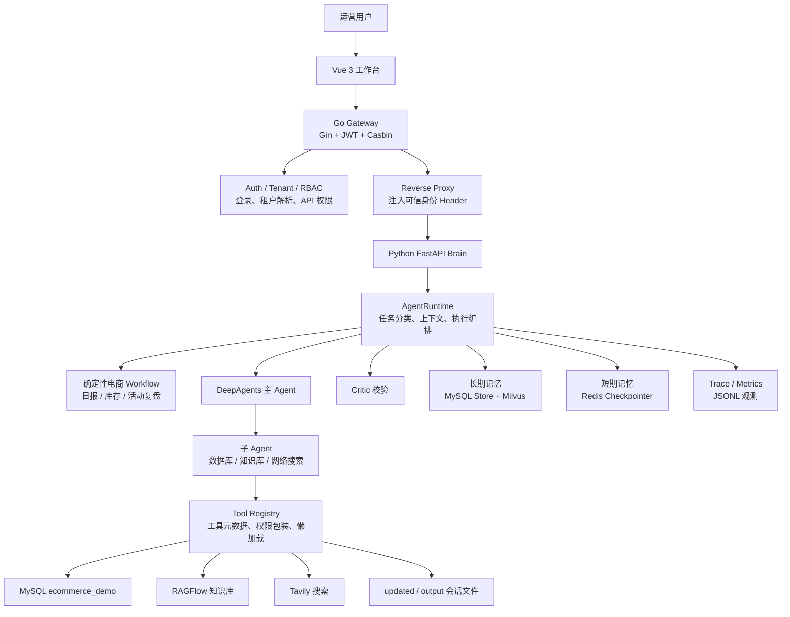

# EcommerceAgent 电商运营数字员工

EcommerceAgent 是一个面向电商运营场景的多 Agent 数字员工项目。项目把 Vue 工作台、Go Gin 网关、Python FastAPI Agent 大脑、DeepAgents/LangGraph、MySQL 电商经营数据、Redis checkpoint、Milvus 长期向量记忆、RAGFlow 知识库和 Tavily 搜索串成一条完整链路，用来完成经营日报、库存预警、活动复盘、爆品分析、退款异常分析、知识库问答和报告生成等任务。

当前版本的目标是：**先落地一版可运行、可演示、具备多用户/多租户/权限边界的电商运营数字员工底座**。项目没有追求一开始就做成复杂分布式平台，而是把关键边界先立起来：

```text
Go Gateway：登录、租户、Casbin API 权限、统一入口
Python Brain：任务运行、Agent 编排、workflow、记忆、工具和资源归属校验
Vue UI：运营工作台、文件上传、实时日志和产物下载
```

## 架构总览



默认请求链路：

```text
Vue UI http://127.0.0.1:5173
  -> Go Gateway http://127.0.0.1:9090
  -> Python Brain http://127.0.0.1:9000
  -> AgentRuntime
  -> deterministic workflow 或 DeepAgent fallback
  -> Critic / memory / trace / 文件产物
```

## 核心能力

- **电商运营工作台**：聊天式任务输入、快捷任务、登录态、租户/店铺上下文、文件上传、实时执行日志、产物侧边栏和下载。
- **Go 网关治理层**：统一 `/api/v1` 入口，提供 JWT 登录、租户解析、Casbin RBAC with domains、统一错误格式和反向代理。
- **可信身份传递**：网关校验后向 Python Brain 注入 `X-User-ID`、`X-Tenant-ID`、`X-Shop-ID`、`X-Permissions` 等可信 Header。
- **资源级隔离**：Python Brain 对任务、文件、trace、policy proposal 做会话和身份作用域校验。
- **确定性 workflow 优先**：日报、库存、活动复盘等高频经营任务先走固定业务流程；不适合或失败时回落 DeepAgent。
- **多 Agent 协作**：主 Agent 调度数据库、知识库、网络搜索等专业子 Agent。
- **工具治理**：Tool Registry 统一注册工具名称、描述、风险等级、权限点和懒加载工厂。
- **短期会话记忆**：LangGraph checkpoint 默认使用 Redis，Redis 不可用时降级为 MemorySaver。
- **长期跨会话记忆**：MySQL 存结构化记忆，Milvus 做语义召回；高风险记忆候选进入人工审核。
- **Critic 质量校验**：按任务类型、风险和工具调用决定是否运行 Critic，并支持一次受控修正。
- **任务队列与运行态**：支持 inline、Redis、NATS 队列；维护 queued/running/interrupted/cancelling/succeeded/failed 状态。
- **观测与追踪**：记录 LLM 调用、工具调用、workflow fallback、Critic、记忆读写、任务生命周期和 Agent 指标。
- **策略进化**：任务后生成反思和策略建议，审核通过后写入 Prompt 覆盖并热重载。

## 模块职责

### `gateway/` Go 网关

网关是系统的统一入口和身份权限边界。

```text
gateway/cmd/server/main.go              网关启动入口
gateway/internal/config/config.go       环境变量配置
gateway/internal/router/router.go       /api/v1 路由和代理绑定
gateway/internal/auth/                  静态用户、JWT 签发和解析
gateway/internal/tenant/                租户和店铺上下文解析
gateway/internal/authorization/         Casbin enforcer 和授权中间件
gateway/internal/middleware/            CORS、Request ID、Auth、Tenant
gateway/internal/errors/                网关统一错误响应
gateway/internal/proxy/brain_proxy.go   Python Brain 反向代理和可信 Header 注入
gateway/configs/casbin/                 Casbin model.conf / policy.csv
```

网关处理顺序：

```text
RequestID
 -> CORS
 -> Auth JWT
 -> Tenant Resolver
 -> CasbinAuthorize
 -> BrainProxy
 -> Python Brain
```

当前 Casbin 模型是 RBAC with domains：

```text
sub = user_id
dom = tenant_id
obj = API 路由模式，例如 /api/v1/tasks/:id
act = HTTP method，例如 GET / POST
```

默认本地账号来自环境变量，未配置时为：

```text
username: local_user
password: admin123
tenant:   tenant_demo
shop:     default_shop
role:     admin
```

### `api/` Python Brain API

Python Brain 是 Agent 执行服务，不负责登录，但会信任网关注入的身份 Header。

```text
api/server.py        FastAPI 路由：任务、上传、下载、记忆、策略、trace、WebSocket
api/task_queue.py    inline / Redis / NATS 任务队列
api/task_runtime.py  任务状态、取消、恢复、会话并发和资源归属校验
api/monitor.py       WebSocket 实时事件推送
api/context.py       session/thread/identity ContextVar
```

关键设计：

- `trusted_identity()` 优先读取 `X-Tenant-ID / X-User-ID / X-Shop-ID`。
- `TaskRuntime` 保存任务元数据，并提供 `get_scoped()`、`list_scoped()`、`owns_conversation()`。
- 文件下载不再接受前端传绝对路径，而是使用 `conversation_id + filename`。
- trace、policy proposal 等接口会先校验任务或会话是否属于当前身份。

### `agent/` Agent 核心

```text
agent/main_agent.py                 DeepAgents 图构建和 run_deep_agent 入口
agent/runtime/agent_runtime.py      主运行时：prepare -> execute -> critic -> persist -> memory
agent/runtime/agent_runner.py       DeepAgent 执行、循环检测、人工中断
agent/runtime/task_context.py       工作目录、上传文件复制、长期记忆召回、LangGraph config
agent/runtime/result_pipeline.py    Critic、反思、策略建议、长期记忆写入、trace 收尾
agent/runtime/execution_result.py   workflow / DeepAgent 统一执行结果
```

`AgentRuntime` 是 Python Brain 的主编排器。一次任务大致经过：

```text
prepare_context
 -> retrieve_memory
 -> execute_agent
 -> run_critic
 -> persist_result
 -> write_memory
 -> finalize_trace
```

### `agent/workflows/` 确定性电商 Workflow

高频、结构化、依赖数据库指标的任务优先走 workflow。

```text
agent/planning/task_classifier.py      任务分类和推荐执行形态
agent/workflows/workflow_runner.py     workflow 路由、执行和 fallback
agent/workflows/business_metrics.py    经营指标 SQL 查询
agent/workflows/daily_report.py        日报结构
agent/workflows/inventory_warning.py   库存风险结构
agent/workflows/campaign_review.py     活动复盘结构
```

当前支持：

```text
daily_report
inventory_analysis
campaign_review
```

不适合 workflow 的任务，或 workflow 执行失败时，会回落到 DeepAgent。

### `agent/core/` 基础支撑层

```text
agent/core/llm_router.py       模型 profile、懒加载、LLM tracing callback
agent/core/tool_registry.py    工具注册、权限包装、懒加载工具对象
agent/core/db.py               MySQL 配置、只读 SQL、受控写入 SQL
agent/core/agent_spec.py       子 Agent 规格定义
agent/core/runtime_context.py  当前运行上下文快照
```

LLM Router 当前支持三个 profile：

```text
fast_model
reasoning_model
critic_model
```

Tool Registry 当前管理：

```text
generate_markdown
convert_md_to_pdf
read_file_content
run_database_workflow
get_assistant_list
create_ask_delete
internet_search
```

### `agent/memory/` 记忆系统

```text
agent/memory/checkpoint.py     Redis LangGraph Checkpointer
agent/memory/schema.py         MemoryIdentity / MemoryCandidate
agent/memory/store.py          MySQL 长期记忆和审核表
agent/memory/milvus_store.py   Milvus 向量索引和语义搜索
agent/memory/retriever.py      长期记忆召回，Milvus 优先，MySQL fallback
agent/memory/extractor.py      从任务结果抽取记忆候选
agent/memory/writer.py         记忆写入和质量 gating
agent/memory/evolution_memory.py task_events/reflections JSONL 日志
agent/memory/embedding.py      embedding 生成
```

记忆分两类：

```text
短期记忆：Redis checkpoint，服务于当前会话上下文恢复
长期记忆：MySQL Store + Milvus semantic search，服务于跨会话经验召回
```

长期记忆写入流程：

```text
任务结果
 -> reflection
 -> memory extractor
 -> candidate gate
 -> MySQL Store
 -> Milvus embedding
```

长期记忆召回流程：

```text
任务开始
 -> Milvus 搜索 memory_id
 -> MySQL 取详情
 -> 拼入工作环境提示
 -> Milvus 不可用时 MySQL LIKE fallback
```

### `agent/critic/` 质量校验

```text
agent/critic/policy.py        判断是否需要 Critic
agent/critic/critic_agent.py  Critic LLM 调用和结构化问题解析
```

Critic 会根据任务分类、风险、AgentSpec 和工具调用判断是否触发。未通过时，最多触发一次受控修正。

### `agent/security/` 安全控制

```text
agent/security/permissions.py   Agent 工具权限检查
agent/security/prompt_guard.py  Prompt 风险标记
agent/security/redaction.py     密钥、token、连接串脱敏
utils/path_utils.py             session 文件沙箱路径解析
```

注意：Go Gateway 的 Casbin 控制“用户能否访问 API”，Python ToolRegistry 控制“Agent 能否调用工具”。两层权限不是一回事。

### `tools/` 工具层

```text
tools/db_tools.py                 数据库工具 wrapper
tools/database_workflow_tool.py   数据库分析和写入候选 workflow
tools/markdown_tools.py           生成 Markdown 文件
tools/pdf_tools.py                Markdown 转 PDF
tools/upload_file_read_tool.py    读取上传文件
tools/ragflow_tools.py            RAGFlow 知识库问答
tools/tavily_tool.py              Tavily 网络搜索
```

数据库写入默认不直接暴露给 LLM，必须经过候选、沙箱或人工审核链路。

### `ui/` Vue 工作台

```text
ui/src/App.vue       主界面：登录、租户/店铺上下文、聊天、上传、实时日志、文件下载
ui/vite.config.ts    本地开发代理配置
ui/package.json      前端依赖和脚本
```

前端请求默认走：

```text
POST /api/v1/auth/login
POST /api/v1/tasks
GET  /api/v1/files?conversation_id=...
GET  /api/v1/download?conversation_id=...&filename=...
WS   /api/v1/ws/{thread_id}
```

### `data/ecommerce_demo/` 演示数据

```text
data/ecommerce_demo/schema.sql
data/ecommerce_demo/seed_ecommerce_demo.py
data/ecommerce_demo/README.md
```

使用 Olist 数据集作为订单基础，并生成库存、流量、活动、退款、客服工单等模拟运营数据。

## 执行流程

### 登录和授权

```text
前端登录
 -> Go Gateway 校验静态用户
 -> 签发 JWT
 -> 后续请求带 Authorization + X-Tenant-ID + X-Shop-ID
 -> Gateway Auth / Tenant / Casbin 校验
 -> Gateway 注入可信身份 Header
 -> Python Brain 按 Header 解析身份
```

### 创建任务

```text
POST /api/v1/tasks
 -> Gateway 权限校验 task create
 -> Python /api/task
 -> TaskRuntime 登记 queued
 -> TaskQueue 投递
 -> AgentRuntime 执行
 -> WebSocket 推送事件
```

### Agent 执行

```text
PromptGuard 标记
 -> task_classifier 分类
 -> build_task_context 创建 session 工作目录
 -> 长期记忆召回
 -> WorkflowRunner 优先执行确定性 workflow
 -> DeepAgent fallback
 -> Critic
 -> reflection / policy proposal / memory write / trace
```

### 文件访问

```text
上传：POST /api/v1/uploads
下载：GET /api/v1/download?conversation_id=xxx&filename=yyy
列表：GET /api/v1/files?conversation_id=xxx
```

文件下载和列表会先通过网关 API 权限，再由 Python Brain 校验 `conversation_id` 是否属于当前身份。

## 环境要求

- Windows PowerShell 5.1+
- Python 3.12+
- Go 1.22+ 或项目当前 `go.mod` 支持版本
- Node.js 20+
- MySQL 8.x 或兼容版本

推荐本地服务：

- Redis：LangGraph checkpoint，也可作为任务队列。
- Milvus：长期记忆语义检索。
- RAGFlow：知识库问答。
- Tavily：外部搜索。

Redis 不可用时 checkpoint 会自动降级为内存；Milvus 不可用时长期记忆会回退到 MySQL LIKE 检索。

## 环境变量

建议复制 `.env.example` 为 `.env`，再填入真实配置。

```powershell
Copy-Item .env.example .env
```

核心配置示例：

```env
# LLM Backend，兼容 OpenAI 协议
OPENAI_BASE_URL=https://dashscope.aliyuncs.com/compatible-mode/v1
OPENAI_API_KEY=your-api-key
LLM_MODEL=qwen-max
LLM_PROVIDER=openai

# MySQL
MYSQL_HOST=localhost
MYSQL_PORT=3306
MYSQL_USER=root
MYSQL_PASSWORD=your-password
MYSQL_DATABASE=ecommerce_demo

# Redis / Checkpoint
CHECKPOINTER_BACKEND=redis
REDIS_URL=redis://localhost:6379/0

# Task queue
TASK_QUEUE_BACKEND=inline
MAX_AGENT_CONCURRENCY=2

# Gateway Auth / Casbin
GATEWAY_AUTH_ENABLED=true
GATEWAY_JWT_SECRET=dev-only-change-me
GATEWAY_JWT_EXPIRES_SECONDS=7200
GATEWAY_CASBIN_MODEL=gateway/configs/casbin/model.conf
GATEWAY_CASBIN_POLICY=gateway/configs/casbin/policy.csv
GATEWAY_DEMO_USER_ID=local_user
GATEWAY_DEMO_PASSWORD=admin123
GATEWAY_DEMO_TENANT_ID=tenant_demo
GATEWAY_DEMO_SHOP_ID=default_shop

# Milvus，可选
MEMORY_VECTOR_BACKEND=milvus
MILVUS_HOST=localhost
MILVUS_PORT=19530

# RAGFlow / Tavily，可选
RAGFLOW_API_URL=http://your-ragflow-host
RAGFLOW_API_KEY=your-ragflow-key
TAVILY_API_KEY=your-tavily-key
```

手动启动 Go 网关和前端时常用：

```powershell
$env:PYTHON_BRAIN_URL="http://127.0.0.1:9000"
$env:GATEWAY_ADDR=":9090"
$env:VITE_API_BASE_URL="http://127.0.0.1:9090"
$env:VITE_WS_BASE_URL="ws://127.0.0.1:9090"
```

## 安装依赖

首次安装：

```powershell
.\start-dev.cmd -Install
```

脚本会：

1. 创建或复用 `.venv`；
2. 安装 Python 依赖；
3. 执行 `go mod download`；
4. 在 `ui/` 下执行 `npm install`；
5. 启动 Python Brain、Go Gateway、Vue UI。

手动安装：

```powershell
python -m venv .venv
.\.venv\Scripts\python.exe -m pip install -r requirements.txt
go mod download
Push-Location ui
npm install
Pop-Location
```

## 启动服务

### 一键启动

```powershell
.\start-dev.cmd
```

默认启动：

```text
Python Brain  http://127.0.0.1:9000
Go Gateway    http://127.0.0.1:9090
Vue UI        http://127.0.0.1:5173
```

打开：

```text
http://127.0.0.1:5173
```

日志目录：

```text
.run-logs/
```

### 指定端口

```powershell
.\start-dev.cmd -PythonPort 19000 -GatewayPort 19090 -UiPort 15173
```

### 启动并导入演示库

```powershell
.\start-dev.cmd -SeedDemo
```

### 手动启动

Python Brain：

```powershell
.\.venv\Scripts\python.exe -m uvicorn api.server:app --host 127.0.0.1 --port 9000
```

Go Gateway：

```powershell
$env:PYTHON_BRAIN_URL="http://127.0.0.1:9000"
$env:GATEWAY_ADDR=":9090"
go run ./gateway/cmd/server
```

Vue UI：

```powershell
Push-Location ui
$env:VITE_API_BASE_URL="http://127.0.0.1:9090"
$env:VITE_WS_BASE_URL="ws://127.0.0.1:9090"
npm run dev -- --host 127.0.0.1 --port 5173
Pop-Location
```

健康检查：

```powershell
Invoke-RestMethod http://127.0.0.1:9090/health
```

## 本地 Redis

如果 Windows 上有 Docker：

```powershell
docker run --name ecommerce-agent-redis -p 6379:6379 -d redis:7
```

验证：

```powershell
.\.venv\Scripts\python.exe -c "import redis; r=redis.Redis.from_url('redis://localhost:6379/0'); print(r.ping())"
```

## 电商演示数据库

把 Olist CSV 放到：

```text
data/olist/
```

应包含：

```text
olist_customers_dataset.csv
olist_orders_dataset.csv
olist_order_items_dataset.csv
olist_order_payments_dataset.csv
olist_order_reviews_dataset.csv
olist_products_dataset.csv
olist_sellers_dataset.csv
product_category_name_translation.csv
```

导入完整演示库：

```powershell
.\.venv\Scripts\python.exe .\data\ecommerce_demo\seed_ecommerce_demo.py --reset --database ecommerce_demo
```

快速烟测：

```powershell
.\.venv\Scripts\python.exe .\data\ecommerce_demo\seed_ecommerce_demo.py --reset --database ecommerce_demo --limit 1000
```

导入后会创建：

```text
customers
sellers
products
orders
order_items
payments
reviews
inventory
traffic_stats
campaigns
campaign_product_stats
refunds
customer_service_tickets
```

## API 概览

推荐只使用 Go Gateway 的 `/api/v1`。

| Method | Path | 说明 |
| --- | --- | --- |
| `GET` | `/health` | 网关健康检查 |
| `POST` | `/api/v1/auth/login` | 登录并获取 JWT |
| `GET` | `/api/v1/auth/me` | 查询当前用户和租户上下文 |
| `POST` | `/api/v1/auth/logout` | 退出登录，本地 JWT 阶段由客户端删除 token |
| `POST` | `/api/v1/tasks` | 创建 Agent 任务 |
| `GET` | `/api/v1/tasks` | 查询当前身份可见任务 |
| `GET` | `/api/v1/tasks/{thread_id}` | 查询单个任务 |
| `POST` | `/api/v1/tasks/{thread_id}/cancel` | 取消任务 |
| `POST` | `/api/v1/tasks/{thread_id}/resume` | 恢复人工中断任务 |
| `POST` | `/api/v1/uploads` | 上传文件 |
| `GET` | `/api/v1/files?conversation_id=...` | 查询会话输出文件 |
| `GET` | `/api/v1/download?conversation_id=...&filename=...` | 下载会话输出文件 |
| `GET` | `/api/v1/tools/catalog` | 查询工具目录 |
| `POST` | `/api/v1/memories/search` | 检索长期记忆 |
| `GET` | `/api/v1/memories/reviews` | 查询记忆审核候选 |
| `POST` | `/api/v1/memories/reviews/{id}/approve` | 通过记忆候选 |
| `POST` | `/api/v1/memories/reviews/{id}/reject` | 拒绝记忆候选 |
| `GET` | `/api/v1/policy/proposals` | 查询策略建议 |
| `POST` | `/api/v1/policy/proposals/{id}/approve` | 通过策略建议并热重载 |
| `POST` | `/api/v1/policy/proposals/{id}/reject` | 拒绝策略建议 |
| `GET` | `/api/v1/traces/{task_id}` | 查询当前身份可访问任务的原始 trace |
| `GET` | `/api/v1/traces/{task_id}/timeline` | 查询任务时间线 |
| `GET` | `/api/v1/metrics/agents` | 查询 Agent/工具聚合指标 |
| `WS` | `/api/v1/ws/{thread_id}` | 实时任务事件 |

登录示例：

```powershell
$login = @{
  username = "local_user"
  password = "admin123"
} | ConvertTo-Json

$res = Invoke-RestMethod `
  -Uri http://127.0.0.1:9090/api/v1/auth/login `
  -Method Post `
  -ContentType "application/json" `
  -Body $login

$token = $res.access_token
```

创建任务示例：

```powershell
$headers = @{
  Authorization = "Bearer $token"
  "X-Tenant-ID" = "tenant_demo"
  "X-Shop-ID" = "default_shop"
}

$body = @{
  query = "生成最近 7 天电商经营日报，包含 GMV、订单、客单价、退款和库存风险"
} | ConvertTo-Json

Invoke-RestMethod `
  -Uri http://127.0.0.1:9090/api/v1/tasks `
  -Method Post `
  -Headers $headers `
  -ContentType "application/json" `
  -Body $body
```

## 可以尝试的任务

```text
生成最近 7 天电商经营日报，包含 GMV、订单数、客单价、评分、退款和待处理客服风险。
```

```text
检查当前商品库存风险，识别低于安全库存、库存周转慢、销量下滑但库存较高的商品，并给出补货、清仓或活动建议。
```

```text
复盘最近一次电商活动，分析活动期间销售额、订单量、投放成本、ROI、参与商品表现、库存消耗和退款情况。
```

```text
分析近期退款率异常的商品或订单，定位可能的质量、物流、描述、客服或价格问题，并给出降低退款率的运营建议。
```

```text
请读取我上传的运营 SOP 文档，总结其中可以沉淀到知识库的 FAQ。
```

## 验证命令

Python 静态编译检查：

```powershell
.\.venv\Scripts\python.exe -B -m compileall agent api tools utils data\ecommerce_demo
```

Go 网关测试：

```powershell
go test ./gateway/...
```

前端构建：

```powershell
Push-Location ui
npm run build
Pop-Location
```

Python Brain 导入验证：

```powershell
.\.venv\Scripts\python.exe -c "from api.server import app; print(app.title)"
```

Redis checkpoint 验证：

```powershell
.\.venv\Scripts\python.exe -c "from agent.memory.checkpoint import build_checkpointer; print(type(build_checkpointer()).__name__)"
```

## 运行产物和本地文件

```text
output/session_{conversation_id}/      Agent 生成文件
updated/session_{conversation_id}/     用户上传文件
data/memory/*.jsonl                    trace、反思、策略建议等本地运行记录
.run-logs/                             一键启动脚本日志
```

这些目录已在 `.gitignore` 中排除，不应提交到仓库。

## 当前阶段说明

当前版本已经具备本地落地所需的大框架：

```text
Go Gateway 多用户/多租户/API 权限
Python Brain 任务执行和资源归属校验
确定性 workflow + DeepAgent fallback
短期 checkpoint + 长期记忆
Critic + reflection + policy proposal
Trace / metrics / 文件产物
```

为了先落地一版，以下能力可以作为后续生产化增强，不影响当前主流程：

- 上传和 WebSocket 的 conversation 预占更精细化。
- WebSocket / 下载 token 从 query 改为短期 ticket 或其他更安全传输方式。
- CORS 从 `*` 改成生产域名白名单。
- `GATEWAY_JWT_SECRET` 和默认密码在 release 模式下强制检查。
- metrics 从全局聚合改成 tenant/user 级聚合。
- 审计日志和限流中间件。
- Casbin policy 从 CSV 迁移到数据库并支持后台管理。

## 常见问题

### 前端显示未登录或 401

先使用默认本地账号登录：

```text
local_user / admin123
tenant_demo / default_shop
```

确认前端请求走的是 Go Gateway：

```text
VITE_API_BASE_URL=http://127.0.0.1:9090
```

### Casbin 返回无权限

检查：

```text
gateway/configs/casbin/model.conf
gateway/configs/casbin/policy.csv
```

确认用户在当前 tenant 下有角色绑定，例如：

```csv
g, local_user, admin, tenant_demo
```

### Redis 连接失败

本地启动 Redis：

```powershell
docker run --name ecommerce-agent-redis -p 6379:6379 -d redis:7
```

如果暂时不用 Redis：

```env
CHECKPOINTER_BACKEND=memory
TASK_QUEUE_BACKEND=inline
```

### MySQL 连接失败

检查 `.env`：

```env
MYSQL_HOST=localhost
MYSQL_PORT=3306
MYSQL_USER=root
MYSQL_PASSWORD=your-password
MYSQL_DATABASE=ecommerce_demo
```

### 端口被占用

```powershell
.\start-dev.cmd -PythonPort 19000 -GatewayPort 19090 -UiPort 15173
```

## 开发约定

- 不提交 `.env`、`.venv`、运行日志、输出产物、上传文件、本地记忆和 Olist CSV。
- 新增 API 先接入 Go Gateway `/api/v1`，再决定是否需要 Casbin policy。
- Python Brain 不信任前端 body/query 中的用户、租户、店铺字段，优先使用网关注入 Header。
- 新增工具统一注册到 `agent/core/tool_registry.py`。
- 数据库底层能力放在 `agent/core/db.py`，面向 Agent 的工具 wrapper 放在 `tools/db_tools.py`。
- 高频结构化任务优先放到 `agent/workflows/`，再由 `task_classifier.py` 和 `workflow_runner.py` 接入。
- 长期记忆写入优先走 `agent/memory/writer.py`，不要在业务代码里直接写记忆表。
